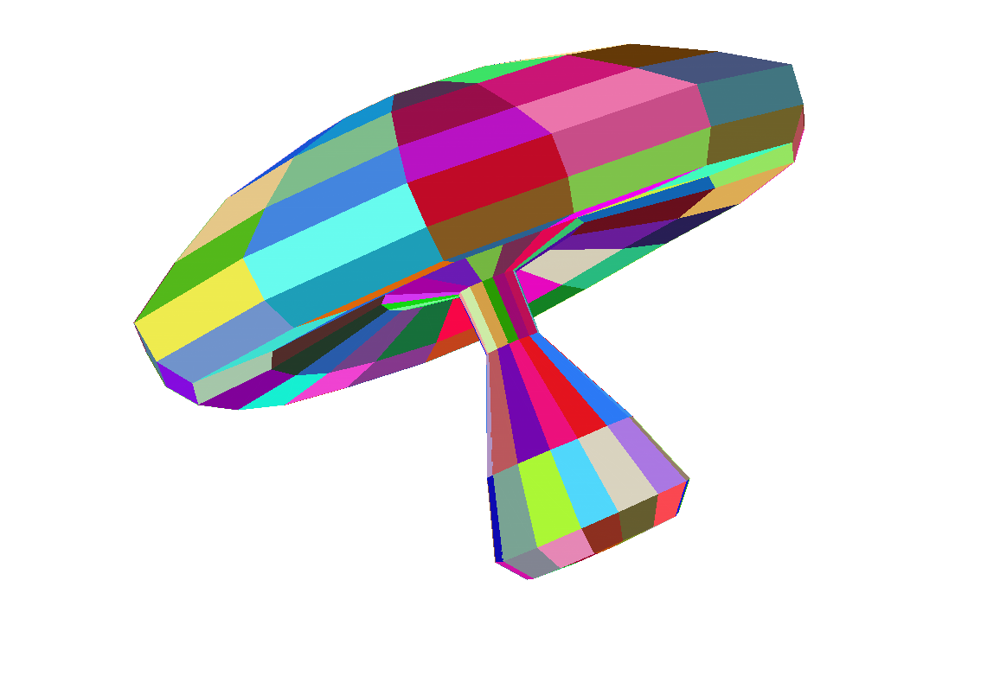
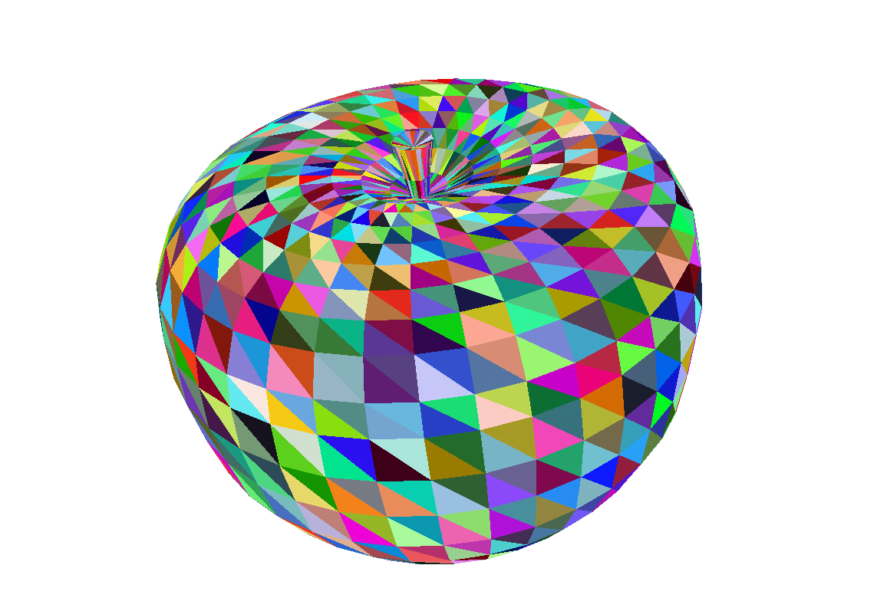
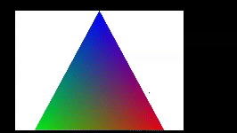
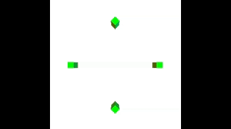

# ScratchRenderer

ScratchRenderer — 3D-рендерер с нуля, написанный на С++, который поддерживает следующие функции:

+ Загрузка 3D-объектов из файлов формата .off, с последующей возможностью параллельного переноса или поворота
+ Проекция трёхмерных объектов на двумерный экран
+ Декомпозиция объектов на треугольники
+ Отрисовка треугольников на экран
+ Повороты и сдвиги камеры
+ Поддержка цвета, заданного вершинам или целым поверхностям
+ Оконное приложение на основе [SFML](https://www.sfml-dev.org/), позволяющее просматривать результаты отрисовки объектов

Реализован ряд unit-тестов с использованием [googletest](https://github.com/google/googletest), имеются примеры работы с рендерером.

## Установка и запуск

Для сборки проекта требуется установленная библиотека SFML. Для Debian-дистрибутивов Linux можно выполнить следующую команду:

```bash
sudo apt-get install libsfml-dev
```

Для других операционных систем инструкции по установке можно найти на сайте [SFML](https://www.sfml-dev.org/tutorials/2.6/#getting-started).

Для установки выполните следующие команды:

```bash
git clone https://github.com/cutehater/3d-renderer.git --recurse-submodules
cd 3d-renderer && mkdir build && cd build
```

Далее для сборки и запуска unit-тестов:

```bash
cmake -DTEST=ON ..
cmake --build .
test/ScratchRendererTests
```

Для сборки и запуска примеров работы:

```bash
cmake -DEXAMPLES=ON ..
cmake --build .
examples/exampleName
```

В примере **pyramid_gradient** создаётся пирамида с трёхцветным градиентом на гранях.

В примере **cubes** создаются четыре куба. Обратите внимание, что для запуска этого примера в директорию, из которой запускаете бинарник, нужно положить файл *cube.off* из models.

В примере **load_model** можно загрузить и добавить объект из .off-файла. Перед сборкой следует поменять *paste_your_model_name.off* на имя вашего .off-файла, и запускать собранный бинарник из директории, в которой находится соответствующий .off-файл.

Управление приложением происходит с клавиатуры. Используйте клавиши **WA/SD/ZX** для сдвига камеры, **IK/JL/QE** для поворота камеры.

## Примеры работы







